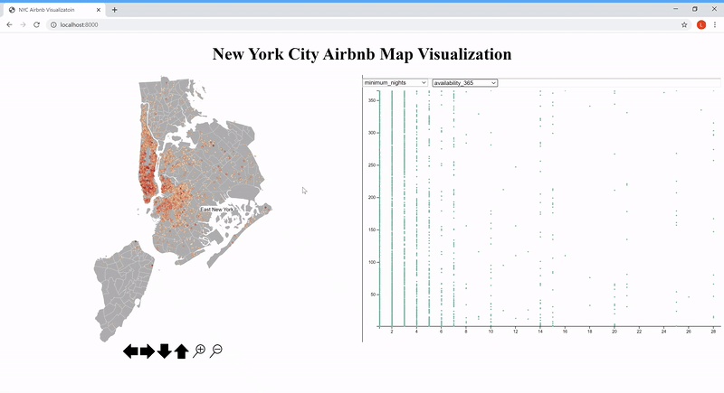
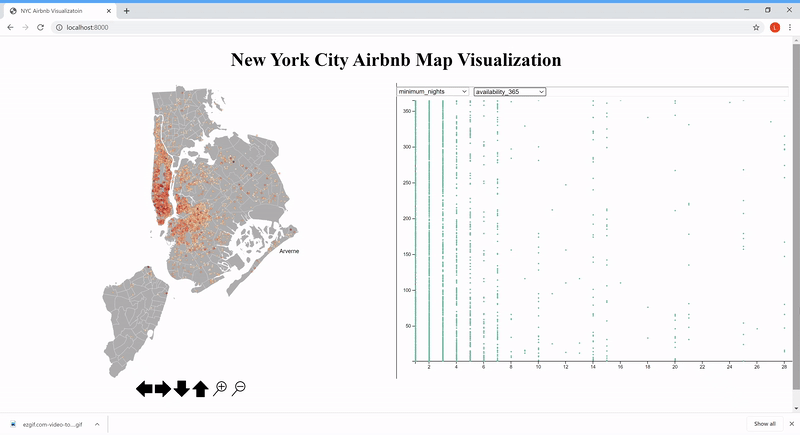
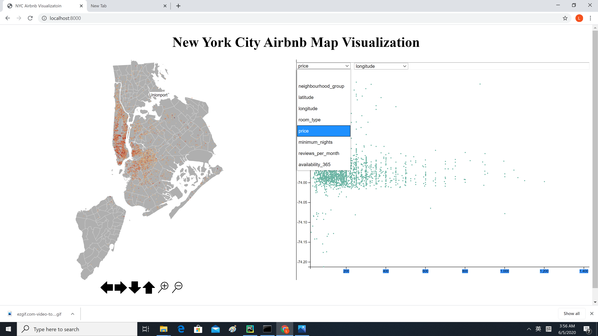
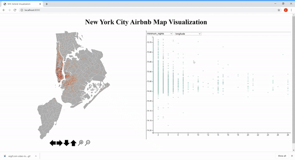

# 2019 New York Airbnb Visualization </h>

## Getting Started
The project will focus on the visualization and analysis of the New York City Airbnb Dataset. 
This data file includes all the needed information to find out more about hosts, geographical 
availability, necessary metrics to make predictions and draw conclusions. We would like to the 
visualization can help find out the relationships between the attributes of Airbnb, such as what 
are the important contributors to the price and what attributes the customers most care about.To
run the code, run the following command in the root directory: python -m http.server

## Visualization List
#### Dot map indicates the location as well as the price of the airbnb house. The redder the house, the higher the price.

#### The dot map also supports move up, move down, move right, move left, zoom in and zoom out.

#### support selecting tags of two axis

#### visualize the relationship between two features by a scatterplot

## Dependencies
Jquery - simplify HTML DOM tree traversal and manipulation, event handling and CSS  
D3 - producing dynamic, interactive data visualizations   
CSS - describing the presentation of a document  

## Contributor
Jiayao Wang,
Liu Wu,
Heyin Yu,
